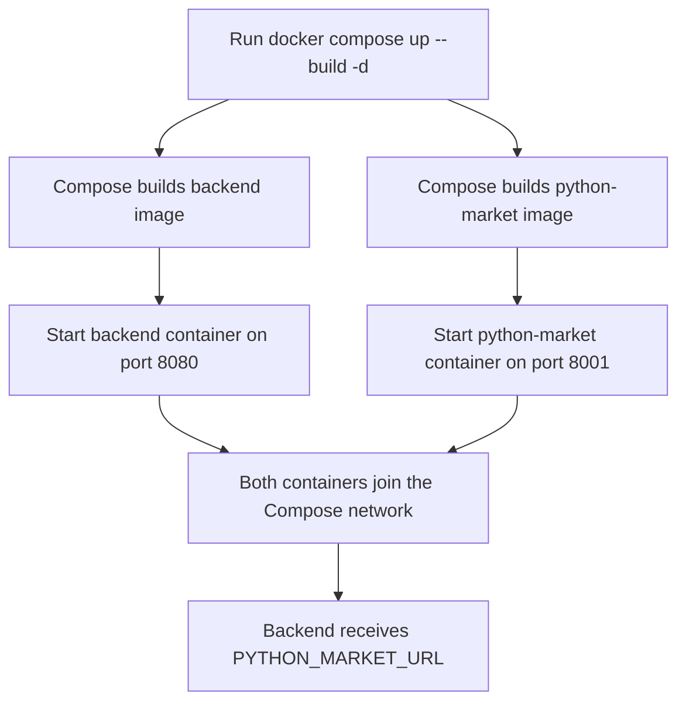
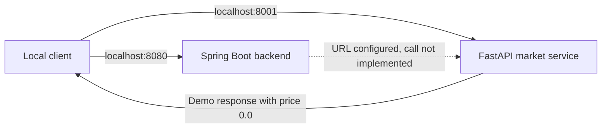
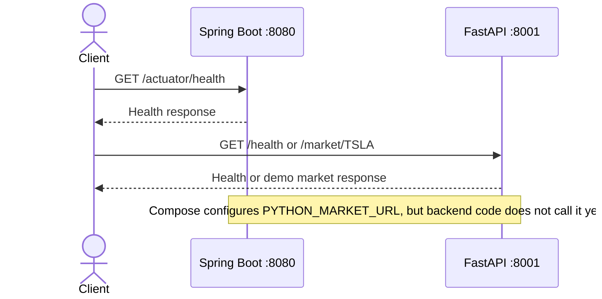

# Day-Zero Service Workflow

## Services

- `backend`: Java 21 / Spring Boot service on port `8080`. It is the intended API and business-logic service. Currently, `StockService` logs stock-symbol processing; there is not yet a stock REST endpoint or Python-service HTTP call.
- `python-market`: Python / FastAPI service on port `8001`. It provides `/health` and a demo `/market/{symbol}` endpoint. The demo currently returns a placeholder price of `0.0`.

## How They Connect

Docker Compose starts both services on the same private network. It also gives the backend `PYTHON_MARKET_URL=http://python-market:8001`, where `python-market` is the Compose service name. Containers use this name to reach one another; the backend should not use `localhost:8001` for this connection.

This is configuration for a future backend-to-Python request. The backend code does not consume `PYTHON_MARKET_URL` yet, so requests to the Python service are not currently made by the backend. The host ports let you call each service directly from your machine.

## Quick Start and Stop

From the project root, build and start both services in the background:

```sh
docker compose up --build -d
```

Check container status and follow logs:

```sh
docker compose ps
docker compose logs -f
```

Test the services in a browser:

- Backend health: http://localhost:8080/actuator/health
- Market service health: http://localhost:8001/health
- Market demo endpoint: http://localhost:8001/market/TSLA

Stop the containers but keep them available to start again:

```sh
docker compose stop
```

Stop and remove the containers and Compose network:

```sh
docker compose down
```

Start them again after `stop` with `docker compose start`.

## Diagrams

### Docker Startup Flow



### Current Request Flow



### Request Sequence



## Backend Docker Build Fix

A Gradle wrapper copied into a Linux container may not have its executable permission, causing `Permission denied` when Docker runs `./gradlew`. The backend Dockerfile fixes this before building:

```dockerfile
RUN chmod +x gradlew
RUN ./gradlew bootJar --no-daemon
```

If the backend build still fails, inspect its output with:

```sh
docker compose logs backend
docker compose build --no-cache backend
```

Then retry with `docker compose up --build`.
